# Boot Sequence

## Overview

When you execute a FlatImage binary, it goes through a carefully orchestrated boot sequence that transforms a single executable file into a fully functional, sandboxed container environment. This document explains the conceptual flow of how FlatImage starts up.

## High-Level Boot Flow

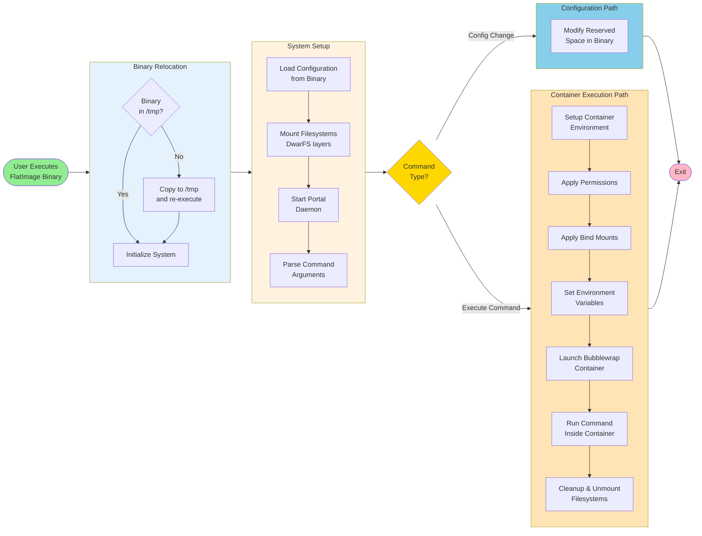

## Phase 1: Binary Relocation

**Purpose**: Ensure the binary runs from `/tmp` where FUSE filesystems can be properly mounted.

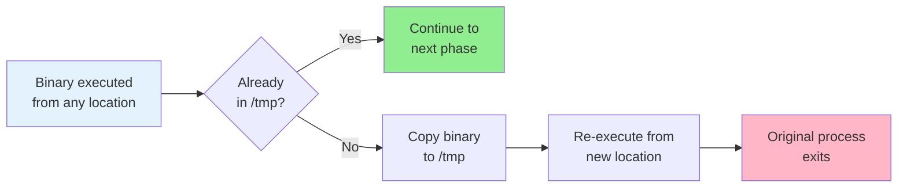

**Why this is necessary:**

- FUSE filesystems require specific mount point permissions
- Simplifies permission handling for mounts
- Ensures consistent behavior regardless of where binary is stored

**What happens:**

1. Binary checks its own path
2. If not in `/tmp`, copies itself there
3. Executes the copy with the same arguments
4. Original process terminates
5. New process continues from `/tmp`

## Phase 2: System Initialization

**Purpose**: Set up the runtime environment and verify system requirements.

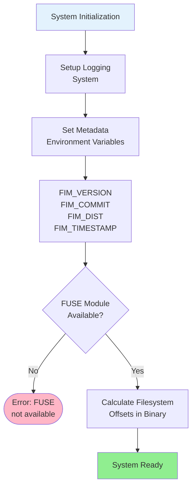

**Key concepts:**

- **Logging**: Debug output controlled by `FIM_DEBUG` environment variable
- **Metadata**: Build-time information embedded in binary (version, commit hash, distribution type, timestamp)
- **FUSE verification**: Ensures kernel module is loaded for filesystem operations
- **Offset calculation**: Determines where DwarFS filesystems begin in the binary

## Phase 3: Configuration Loading

**Purpose**: Extract all configuration from the binary's reserved space and set up runtime paths.

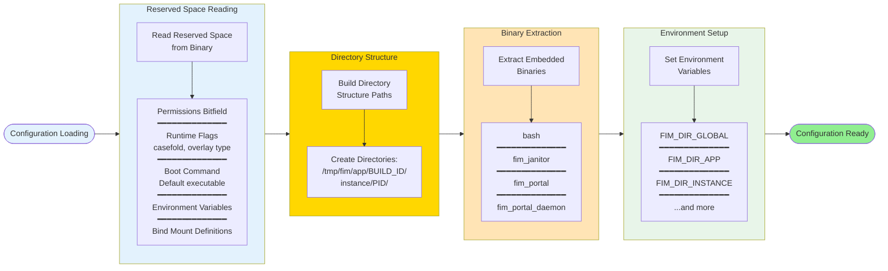

**Configuration sources:**

1. **Reserved space** (3-4 MB embedded in binary)
   - Permissions, boot command, environment, binds, desktop integration
2. **Environment variables** (can override reserved space)
   - `FIM_OVERLAY`, `FIM_CASEFOLD`, `FIM_FILES_LAYER`, etc.
3. **Compiled defaults** (fallback values)

**Directory structure created:**

- Global directory: `/tmp/fim`
- Build-specific: `/tmp/fim/app/{COMMIT}_{TIMESTAMP}`
- Instance-specific: `/tmp/fim/app/.../instance/{PID}`
- Binaries extracted to: `/tmp/fim/app/.../bin/`

## Phase 4: Filesystem Setup

**Purpose**: Mount the layered filesystem stack that becomes the container's root.

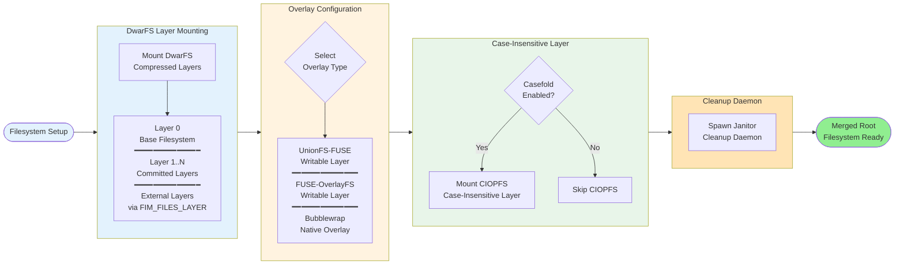

**Filesystem layers (bottom to top):**

1. **Base layer**: Core filesystem (Alpine/Arch/Blueprint)
2. **Committed layers**: Previously saved changes
3. **External layers**: Mounted from host filesystem
4. **Writable overlay**: Temporary changes (UnionFS/OverlayFS/BWRAP native)
5. **Case-insensitive layer** (optional): CIOPFS for Wine/Proton compatibility

**Janitor daemon:**

- Monitors parent process health
- Automatically unmounts filesystems if parent crashes
- Prevents stale FUSE mounts

## Phase 5: Portal Daemon Startup

**Purpose**: Enable inter-process communication between host and container.

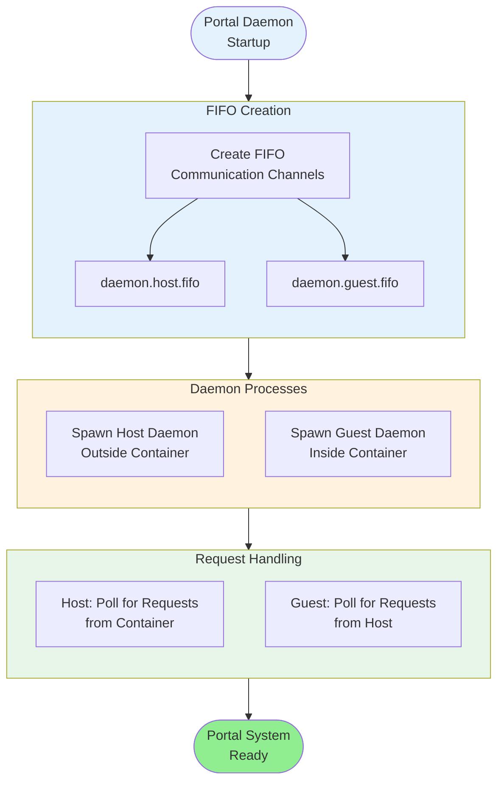

**Portal capabilities:**

- Container can execute commands on host
- Host can execute commands in container (via `fim-instance`)
- Full stdin/stdout/stderr redirection
- Signal forwarding (Ctrl+C, etc.)

## Phase 6: Command Parsing

**Purpose**: Determine what action to take based on command-line arguments.

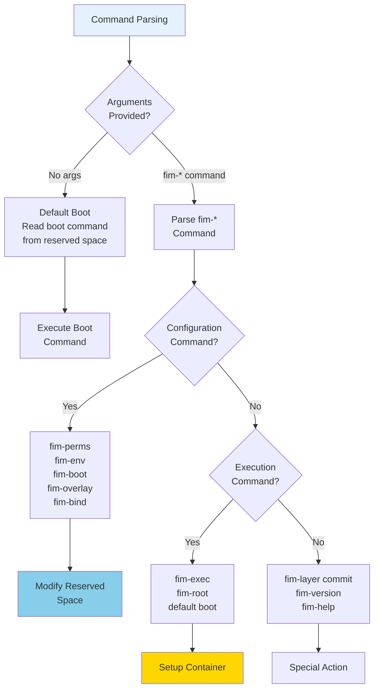

**Command categories:**

1. **Configuration commands**: Modify binary without starting container
   - `fim-perms add network,gpu`
   - `fim-env set VAR=value`
   - `fim-boot set firefox`
2. **Execution commands**: Start container and run command
   - `fim-exec firefox` (run as user)
   - `fim-root apk add vim` (run as root)
   - Default boot (no arguments)
3. **Layer commands**: Manage filesystem layers
   - `fim-layer commit` (compress overlay to new layer)
4. **Utility commands**: Information and help
   - `fim-version`, `fim-help`

## Phase 7: Container Setup (for Execution Commands)

**Purpose**: Configure Bubblewrap to create the sandboxed environment.

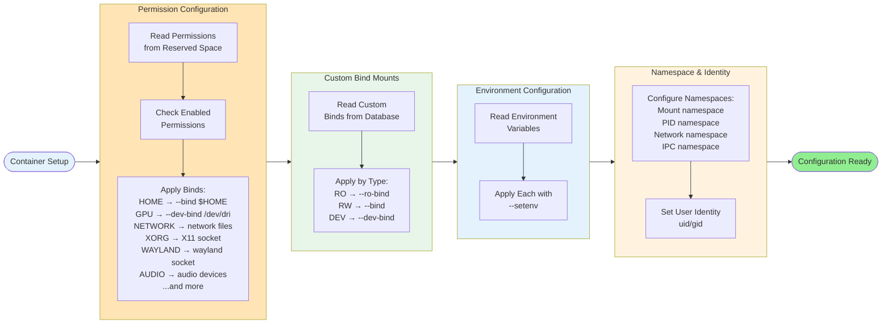

**Isolation mechanisms:**

- **Mount namespace**: Container sees isolated filesystem
- **Network namespace**: No network unless `network` permission granted
- **PID namespace**: Process isolation (optional)
- **IPC namespace**: No inter-process communication with host
- **User namespace**: Unprivileged containers (no root required)

**Permission system:**

- **Default**: Full isolation (deny-all)
- **Opt-in**: Each permission explicitly grants access
- **Granular**: 15+ different permissions available
- **Composable**: Permissions can be combined

## Phase 8: Container Execution

**Purpose**: Launch Bubblewrap and execute the command inside the sandbox.

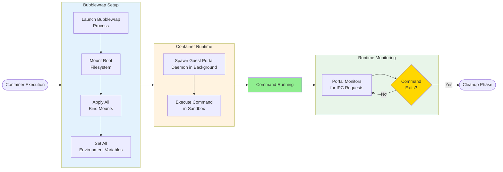

**What happens inside:**

1. Guest portal daemon starts (optional, for host→container commands)
2. Bubblewrap creates isolated namespaces
3. Root filesystem mounted (merged layers + overlay)
4. All bind mounts applied
5. Environment variables set
6. Command executed (bash, firefox, etc.)
7. Portal system active for IPC
8. Command runs until completion or signal

**During execution:**

- Container has access only to granted permissions
- Portal enables host communication if needed
- Standard I/O works normally
- Signals forwarded (Ctrl+C terminates cleanly)

## Phase 9: Cleanup

**Purpose**: Properly shut down the container and unmount filesystems.

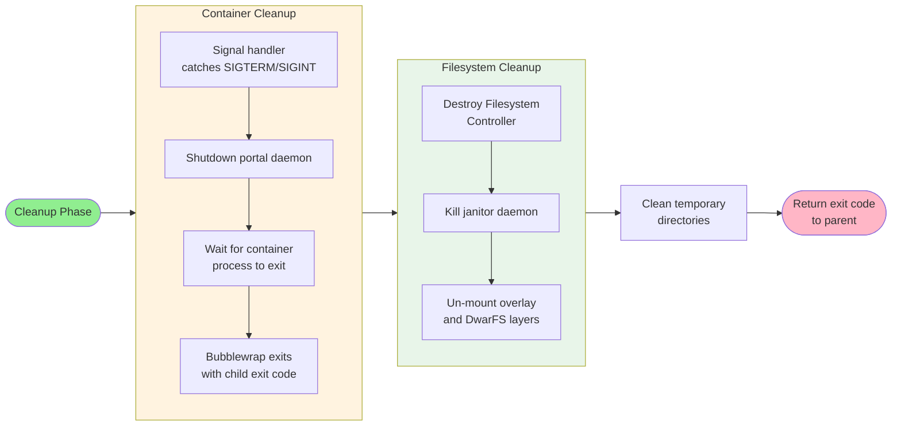

**Cleanup order:**

1. Command finishes execution
2. Guest portal daemon stopped
3. Bubblewrap exits
4. Filesystem controller destroyed
5. Janitor daemon signaled to terminate
6. Filesystems unmounted (CIOPFS → overlay → DwarFS layers)
7. Temporary directories cleaned
8. Exit code returned to shell

**Graceful vs. crash handling:**

- **Graceful exit**: All cleanup happens in order
- **Crash/kill**: Janitor daemon detects parent death and unmounts filesystems
- **Result**: No stale FUSE mounts in either case

## Boot Sequence Timeline

```mermaid
gantt
    title FlatImage Boot Sequence Timeline (Typical)
    dateFormat X
    axisFormat %L ms

    section Phase 1
    Binary Relocation (if needed) :0, 50

    section Phase 2
    System Initialization :50, 100

    section Phase 3
    Configuration Loading :100, 200

    section Phase 4
    Filesystem Setup :200, 700

    section Phase 5
    Portal Startup :700, 750

    section Phase 6
    Command Parsing :750, 755

    section Phase 7
    Container Setup :755, 1055

    section Phase 8
    Container Execution :milestone, 1055, 0
```

**Performance factors:**

- Number of DwarFS layers (more = slower)
- Overlay type (BWRAP fastest, UnionFS slowest)
- Casefold enabled (adds CIOPFS overhead)
- External layers (network/disk latency)