# Filesystem Lifecycle

## Overview

FlatImage uses a sophisticated multi-layered filesystem architecture combining compressed read-only layers with writable overlays. Understanding how these filesystems are spawned and terminated is crucial for debugging and extending the system.

This document describes the complete lifecycle of FUSE-based filesystems in FlatImage, from initialization to cleanup.

## Architecture Components

### Key Components

1. **Controller** - Orchestrates all filesystem mounts and manages their lifecycle
2. **Filesystem Base Class** - Abstract base class that manages FUSE process lifecycle
3. **Subprocess** - Handles process spawning, waiting, and PID tracking
4. **Janitor** - Fallback cleanup daemon that monitors the parent process

### Filesystem Implementations

FlatImage supports multiple filesystem types, each serving a specific purpose:

- **DwarFS** - Compressed read-only base layers embedded in the binary or provided externally
- **UnionFS** - Pure FUSE union filesystem for writable overlay
- **OverlayFS** - FUSE-based overlayfs for better performance
- **CIOPFS** - Case-insensitive filesystem layer (optional)

## Lifecycle Phases

### Phase 1: Initialization (Mount)

During initialization, the Controller mounts filesystems in a specific order to create a layered stack:

1. **DwarFS Layers** (Bottom) - Multiple compressed read-only layers (embedded and external)
2. **Overlay Layer** (Middle) - UnionFS or OverlayFS for write access
3. **CIOPFS Layer** (Top) - Optional case-insensitive wrapper

Each filesystem follows this pattern:

```cpp
// Create the filesystem object
m_child = ns_subprocess::Subprocess("fuse_program")
    .with_args(mount_args)
    .with_die_on_pid(controller_pid)
    .spawn();  // Returns immediately, keeps PID valid

// Wait for mount to appear in kernel
ns_fuse::wait_fuse(mount_point);  // Polls statfs() until mounted
```

**Critical Pattern**: The `.spawn()` method returns immediately after forking, keeping `m_pid` valid. The FUSE daemon daemonizes itself, and we wait for the mount to appear using `wait_fuse()` which polls the kernel's filesystem table.

### Phase 2: Runtime

During runtime, all FUSE daemons run independently as background processes:

- Each FUSE daemon is configured with `with_die_on_pid(controller_pid)` using `PR_SET_PDEATHSIG`
- If the controller process dies unexpectedly, all FUSE daemons receive `SIGKILL`
- The Janitor process monitors the controller and provides fallback cleanup

### Phase 3: Termination (Unmount)

Termination follows strict LIFO (Last-In-First-Out) ordering:

1. **Janitor termination** - Stopped first with `SIGTERM`
2. **CIOPFS unmount** - Top layer removed
3. **Overlay unmount** - Middle layer removed
4. **DwarFS layers unmount** - Base layers removed in reverse order

## Filesystem Initialization Flow Diagram

The initialization phase mounts filesystems in a specific order to create the layered stack:

```mermaid
flowchart LR
    Start(["📦 Initialization"]) --> InitSetup

    subgraph InitSetup["Initialization Setup"]
        direction TB
        I1["🔍 Check Configuration<br/>overlay_type, casefold flag"]
        I2["📂 Create Mount Directories<br/>DwarFS layers, overlays, work dirs"]

        I1 --> I2
    end

    InitSetup --> EmbeddedLayers

    subgraph EmbeddedLayers["🔴 STEP 1: Embedded DwarFS Layers"]
        direction TB
        E1["Open flatimage binary<br/>Seek to reserved offset"]
        E2["Read 8-byte filesystem size"]
        E3{size > 0?}
        E4["Check DWARFS header at offset"]
        E5["Spawn: dwarfs flatimage.flatimage mount<br/>-o offset=X,imagesize=Y"]
        E6["⏳ Wait for FUSE mount<br/>Poll statfs until FUSE_SUPER_MAGIC"]
        E7["✓ Layer mounted<br/>Store in m_layers vector"]
        E8["Advance offset by 8 + size"]

        E1 --> E2
        E2 --> E3
        E3 -->|Yes| E4
        E4 --> E5
        E5 --> E6
        E6 --> E7
        E7 --> E8
        E8 --> E2
    end

    EmbeddedLayers --> ExternalLayers

    subgraph ExternalLayers["🟠 STEP 2: External DwarFS Layers"]
        direction TB
        X1["Get FIM_LAYERS env var"]
        X2["For each path:<br/>If directory, collect files<br/>If file, use directly"]
        X3["For each file:<br/>Check DWARFS header"]
        X4["Get file size"]
        X5["Spawn: dwarfs layer_file mount<br/>-o offset=0,imagesize=size"]
        X6["⏳ Wait for FUSE mount"]
        X7["✓ External layer mounted<br/>Store in m_layers vector"]

        X1 --> X2
        X2 --> X3
        X3 --> X4
        X4 --> X5
        X5 --> X6
        X6 --> X7
    end

    ExternalLayers --> OverlayMount

    subgraph OverlayMount["🟢 STEP 3: Overlay Writable Layer"]
        direction TB
        O1{overlay_type?}
        O2["OVERLAYFS:<br/>fuse-overlayfs<br/>lowerdir, upperdir, workdir"]
        O3["UNIONFS:<br/>unionfs-fuse<br/>cow /upper=RW:/0=RO"]
        O4["BWRAP:<br/>Skip - bwrap handles natively"]
        O5["⏳ Wait for FUSE mount"]
        O6["✓ Overlay mounted<br/>Store in m_filesystems vector"]

        O1 -->|OVERLAYFS| O2
        O1 -->|UNIONFS| O3
        O1 -->|BWRAP| O4
        O2 --> O5
        O3 --> O5
        O5 --> O6
        O4 --> O6
    end

    OverlayMount --> CasefoldCheck

    subgraph CasefoldCheck["🔵 STEP 4: Case-Insensitive Layer"]
        direction TB
        C1{casefold enabled<br/>AND not BWRAP?}
        C2["Spawn: ciopfs /overlay /casefold"]
        C3["⏳ Wait for FUSE mount"]
        C4["✓ CIOPFS mounted<br/>Store in m_filesystems vector"]
        C5["Skip CIOPFS"]

        C1 -->|Yes| C2
        C1 -->|No| C5
        C2 --> C3
        C3 --> C4
    end

    CasefoldCheck --> JanitorSetup

    subgraph JanitorSetup["🟣 STEP 5: Janitor Cleanup Daemon"]
        direction TB
        J1["Spawn: fim_janitor<br/>parent_pid, log_file, mountpoints"]
        J2["Janitor detaches and monitors<br/>via kill parent_pid, 0 loop"]
        J3["Janitor ready"]

        J1 --> J2
        J2 --> J3
    end

    JanitorSetup --> Ready(["✅ Controller Ready<br/>All filesystems mounted"])

    style InitSetup fill:#e1f5ff
    style EmbeddedLayers fill:#fff3e0
    style ExternalLayers fill:#ffecb3
    style OverlayMount fill:#fce4ec
    style CasefoldCheck fill:#f1f8e9
    style JanitorSetup fill:#e0f2f1
    style Start fill:#e1f5ff
    style Ready fill:#c8e6c9
```



---

## Filesystem Destruction Flow Diagram

The destruction phase unmounts filesystems in reverse (LIFO) order to avoid dependency issues:

```mermaid
flowchart LR
    Start(["🔴 Destruction Begins<br/>~Controller() called"]) --> JanitorTerm

    subgraph JanitorTerm["⏸️ STEP 1: Terminate Janitor"]
        direction TB
        J1["Send SIGTERM to janitor_pid"]
        J2["Janitor signal handler<br/>sets G_CONTINUE = false"]
        J3["Janitor exits monitoring loop"]
        J4["Janitor unmounts remaining<br/>FUSE filesystems<br/>if main process crashed"]
        J5["waitpid janitor_pid<br/>Reap janitor process"]
        J6["✓ Janitor cleaned up"]

        J1 --> J2
        J2 --> J3
        J3 --> J4
        J4 --> J5
        J5 --> J6
    end

    JanitorTerm --> CiopfsDestroy

    subgraph CiopfsDestroy["🔵 STEP 2A: Destroy CIOPFS"]
        direction TB
        CI1["~Ciopfs destructor<br/>if CIOPFS exists"]
        CI2["1. ns_fuse::unmount /casefold<br/>fusermount -zu + poll until gone"]
        CI3["2. kill ciopfs_pid, SIGTERM<br/>Terminate FUSE daemon"]
        CI4["3. m_child->wait<br/>Reap process & check status"]
        CI5["✓ CIOPFS destroyed"]

        CI1 --> CI2
        CI2 --> CI3
        CI3 --> CI4
        CI4 --> CI5
    end

    CiopfsDestroy --> OverlayDestroy

    subgraph OverlayDestroy["🟢 STEP 2B: Destroy Overlay"]
        direction TB
        OV1["~Overlayfs or ~UnionFs<br/>if overlay exists"]
        OV2["1. ns_fuse::unmount /overlay"]
        OV3["2. kill overlay_pid, SIGTERM"]
        OV4["3. m_child->wait"]
        OV5["✓ Overlay destroyed"]

        OV1 --> OV2
        OV2 --> OV3
        OV3 --> OV4
        OV4 --> OV5
    end

    OverlayDestroy --> LayersDestroy

    subgraph LayersDestroy["🟠 STEP 3: Destroy DwarFS Layers"]
        direction TB
        L1["For each layer in reverse order<br/>external first, then embedded"]
        L2["1. ns_fuse::unmount /mount/layers/N"]
        L3["2. kill dwarfs_pid, SIGTERM"]
        L4["3. m_child->wait"]
        L5{More layers?}
        L6["✓ All layers destroyed"]

        L1 --> L2
        L2 --> L3
        L3 --> L4
        L4 --> L5
        L5 -->|Yes| L2
        L5 -->|No| L6
    end

    LayersDestroy --> DirCleanup

    subgraph DirCleanup["🟣 STEP 4: Cleanup Directories"]
        direction TB
        D1["Remove overlays/upperdir"]
        D2["Remove overlays/workdir/pid"]
        D3["/tmp/fim/ directory persists<br/>for debugging janitor logs"]

        D1 --> D2
        D2 --> D3
    end

    DirCleanup --> Complete(["✅ Complete Cleanup<br/>All processes terminated<br/>All mounts removed"])

    style JanitorTerm fill:#ffecb3
    style CiopfsDestroy fill:#f1f8e9
    style OverlayDestroy fill:#e8f5e9
    style LayersDestroy fill:#fff3e0
    style DirCleanup fill:#e0f2f1
    style Start fill:#ffcdd2
    style Complete fill:#c8e6c9
```



---

## Debugging Tips

### Enable Debug Logging

```bash
export FIM_DEBUG=1
./app.flatimage fim-exec command
```

### Check Logs

```bash
# Janitor logs
cat /tmp/fim/app/*/instance/*/logs/janitor/janitor.log
cat /tmp/fim/app/*/instance/*/logs/janitor/janitor.parent.reader.stdout.log
cat /tmp/fim/app/*/instance/*/logs/janitor/janitor.parent.reader.stderr.log

# Boot logs
cat /tmp/fim/app/*/instance/*/logs/boot/boot.log

# Bwrap logs
cat /tmp/fim/app/*/instance/*/logs/bwrap/bwrap.log
cat /tmp/fim/app/*/instance/*/logs/bwrap/bwrap-apparmor.log

# Portal logs
cat /tmp/fim/app/*/instance/*/logs/portal/daemon.host.log
cat /tmp/fim/app/*/instance/*/logs/portal/daemon.guest.log
cat /tmp/fim/app/*/instance/*/logs/portal/cli.log
```

### Verify Mounts

```bash
# Check if mountpoint is FUSE
findmnt -t fuse

# Check FUSE processes
ps aux | grep -E 'dwarfs|unionfs|overlayfs|ciopfs'

# Manually unmount if stuck
fusermount -zu /path/to/mount
```
### Tips

**Stale mounts after crash:**
- Symptom: Directory appears empty or gives "Transport endpoint not connected"
- Cause: FUSE daemon died but mount entry remains
- Solution: `fusermount -zu /path/to/mount`

**"Device or resource busy" on cleanup:**
- Symptom: Cannot remove `.app.flatimage.data` directory
- Cause: FUSE filesystem still mounted
- Solution: Unmount manually, check for orphaned FUSE processes