# Architecture Overview

## What is FlatImage?

FlatImage is a **single-file container system** for Linux. Everything—code, dependencies, configuration, and filesystems—is packaged into one executable. No installation required, no external files needed.

**Key Features:**

- 📦 **Single file** - One executable contains everything
- 🔒 **Sandboxed** - Secure isolation with granular permissions
- ⚙️ **Reconfigurable** - Change settings after build without recompiling
- 🗜️ **Compressed** - DwarFS compression for efficient storage
- 🔌 **Integrated** - Desktop integration, portal IPC, Wine/Proton support

## Architecture Modules

FlatImage is organized into distinct modules, each handling a specific responsibility:


## 1. Boot Module

The boot module is the **entry point** for FlatImage execution. It handles initial setup and binary relocation.


**Responsibilities:**

- Initialize logging system
- Set version/commit/distribution metadata
- Relocate binary to `/tmp` if needed (FUSE requirement)
- Verify FUSE kernel module is loaded
- Calculate filesystem offsets in binary

## 2. Config Module

The config module is the **central configuration object** that contains all runtime settings. Every other module depends on this.


**Responsibilities:**

- Define all filesystem paths (`FIM_DIR_*`)
- Configure logging for all subsystems
- Read flags from reserved space (casefold, overlay type)
- Set up module configurations
- Extract embedded binaries to `/tmp/fim/.../bin/`
- Set environment variables

## 3. Reserved Space Module

Reserved space is a **configuration storage area** embedded in the ELF binary. This enables post-build reconfiguration.


**Responsibilities:**

- Store configuration data in the binary
- Provide read/write functions for configuration
- Validate space constraints at compile-time
- Enable `fim-*` commands to modify binary

**Configuration Components:**

- **Permissions** - Permission bitfield
- **Boot Command** - Default command
- **Environment** - Custom env vars
- **Bind Mounts** - Host-guest mounts
- **Icon** - PNG icon data
- **Desktop** - Desktop integration
- **Notify, Overlay, Casefold** - Flags

## 4. DB Module

The DB module provides safe wrappers around reserved space for complex configurations stored as JSON.


**Responsibilities:**

- Serialize/deserialize configuration to JSON
- Provide high-level APIs for configuration management
- Abstract away reserved space offsets
- Validate configuration data

## 5. Filesystems Module

The filesystems module **mounts and manages** the layered filesystem stack that provides the container's root.


**Responsibilities:**

- Mount DwarFS compressed layers
- Set up overlay filesystem (writable layer)
- Optionally mount CIOPFS for case-insensitivity
- Coordinate filesystem lifecycle
- Spawn janitor for cleanup

**Layer Stack:**
```
┌─────────────────────┐
│ CIOPFS (optional)   │ ← Case-insensitive
├─────────────────────┤
│ Overlay (writable)  │ ← Changes go here
├─────────────────────┤
│ Layer N             │ ← External/committed
│ Layer 1             │ ← Committed
│ Layer 0             │ ← Base
└─────────────────────┘
```

## 6. Janitor Module

The janitor is a **cleanup daemon** that ensures filesystems are properly unmounted if the parent process crashes.


**Responsibilities:**

- Monitor parent process health
- Unmount filesystems on parent death
- Prevent stale FUSE mounts
- Log cleanup operations

**Why It's Needed:**

- If FlatImage crashes, FUSE mounts remain
- Stale mounts can cause system issues
- Janitor ensures clean cleanup

## 7. Portal Module

The portal module provides **IPC between host and container** using FIFO-based message passing.


**Responsibilities:**

- Enable host-container command execution
- Redirect stdin/stdout/stderr between processes
- Forward signals (Ctrl+C, etc.)
- Maintain FIFO communication channels

**How It Works:**

1. **Daemon** listens on FIFO for requests
2. **Dispatcher** sends JSON request to daemon
3. **Daemon** forks child process to execute command
4. **Child** redirects I/O through FIFOs
5. **Dispatcher** forwards I/O to/from caller
6. **Exit code** returned via FIFO

**Use Cases:**

- Execute host commands from container
- Execute container commands from host
- Multi-instance communication

## 8. Subprocess Module

The subprocess module provides **process management utilities** for spawning and controlling child processes.


**Responsibilities:**

- Build process execution configuration
- Fork and exec child processes
- Manage process lifetime
- Provide process control (kill, wait, status)

**Key Features:**

- Builder pattern for configuration
- RAII process management
- Signal handling
- Log file redirection

**Used By:**

- Portal daemon (spawning commands)
- Filesystem controller (spawning janitor)
- FUSE mounts (spawning dwarfs, overlayfs, etc.)

## 9. Bwrap Module

The bwrap module is a **wrapper around Bubblewrap** that creates the sandboxed container environment.

```mermaid
graph TB
    subgraph Input["Input Configuration"]
        Perms[Permissions Bitfield<br/>HOME, GPU, NETWORK, etc.]
        User[User Data<br/>uid/gid, name, home, shell]
        Binds[Bind Mounts<br/>RO/RW/DEV]
        Env[Environment Variables]
        Overlay[Overlay Config<br/>layers, upper, work]
    end

    subgraph BwrapClass["Bwrap Class"]
        direction TB
        BuildArgs["Build Arguments<br/>--bind, --dev-bind, --ro-bind<br/>--setenv, --uid, --gid<br/>--tmpfs, --proc, --dev"]

        ApplyPerms["Apply Permissions<br/>Loop through bitfield"]

        PermChecks["Permission Mappings:<br/><br/>HOME → --bind $HOME $HOME<br/>MEDIA → --bind /media /media<br/>AUDIO → --ro-bind /dev/snd<br/>WAYLAND → --ro-bind $XDG_RUNTIME_DIR<br/>XORG → --ro-bind /tmp/.X11-unix<br/>GPU → --dev-bind /dev/dri + NVIDIA symlinks<br/>NETWORK → --share-net<br/>DBUS_USER → --bind dbus user socket<br/>DBUS_SYSTEM → --bind dbus system socket<br/>UDEV → --ro-bind /run/udev<br/>INPUT → --dev-bind /dev/input<br/>USB → --dev-bind /dev/bus/usb<br/>SHM → --bind /dev/shm<br/>OPTICAL → --ro-bind /dev/sr*<br/>DEV → --dev /dev"]

        BuildArgs --> ApplyPerms
        ApplyPerms --> PermChecks
    end

    subgraph Execution["Execute Container"]
        SetupOverlay["Setup Filesystem:<br/>Native overlay OR<br/>--bind mount/ /"]

        SpawnPortal["Spawn Portal Daemon:<br/>nohup daemon & disown"]

        ExecCommand["Execute Command:<br/>bash -c 'program args'"]

        ErrorPipe["Error Pipe:<br/>syscall_nr, errno_nr"]

        SetupOverlay --> SpawnPortal
        SpawnPortal --> ExecCommand
        ExecCommand --> ErrorPipe
    end

    Perms --> ApplyPerms
    User --> BuildArgs
    Binds --> BuildArgs
    Env --> BuildArgs
    Overlay --> SetupOverlay

    PermChecks --> SetupOverlay

    style BwrapClass fill:#FFE4B5
    style Input fill:#E3F2FD
    style Execution fill:#E8F5E9
```



**Responsibilities:**

- Construct bubblewrap command line
- Apply permission-based filesystem binds
- Configure container namespaces
- Set user/group identity
- Apply environment variables
- Execute command in sandbox

**Isolation:**

- Default: Full isolation, no host access
- Opt-in: Each permission grants specific access
- Namespaces: Separate process, mount, IPC, network spaces

## Module Interaction Flow

Here's how the modules work together during a typical FlatImage execution:


## Key Architectural Patterns

### 1. Central Configuration Object

The `FlatImage` struct in `config.hpp` acts as a **single source of truth** for all runtime configuration. Every module receives its configuration from this central object.

**Benefits:**

- Predictable initialization order
- No global state scattered across modules
- Easy to understand dependencies

### 2. Reserved Space for Persistence

Configuration is stored **inside the binary** rather than external files. This enables single-file portability while maintaining configurability.

**Benefits:**

- No external configuration files
- Configuration travels with binary
- Post-build reconfiguration

### 3. Layered Filesystem

Multiple **read-only compressed layers** with a **writable overlay** on top provides efficiency and flexibility.

**Benefits:**

- High compression ratios
- Incremental updates via layer commits
- Shared base layers
- Fast decompression

### 4. Process Isolation via Namespaces

Uses Linux **user namespaces** and **Bubblewrap** for unprivileged sandboxing with granular permissions.

**Benefits:**

- No root required
- Fine-grained access control
- Standard Linux isolation

### 5. FIFO-based IPC

The portal system uses **named pipes (FIFOs)** for simple, reliable host-container communication.

**Benefits:**

- Standard Unix IPC
- Full I/O redirection
- Signal forwarding
- No complex protocols