# Portal

## Overview

The Portal system provides inter-process communication (IPC) between the container and host environment. It enables transparent command execution across isolation boundaries using a FIFO-based message passing architecture.

The Portal consists of dual daemons (host and guest) that receive process execution requests via FIFOs, spawn the requested processes with redirected I/O, and relay their streams back to the dispatcher. Configuration is passed through environment variables to avoid shell escaping issues.

## Architecture Components

### Key Components

1. **Portal Daemon** (`fim_portal_daemon`) - Main daemon process running on both host and guest
2. **Portal Dispatcher** (`fim_portal`) - Client interface for sending process requests
3. **Child Spawner** - Handles process forking and execution using `ns_subprocess::Subprocess`
4. **FIFO Communication** - Named pipe creation and management
5. **Monitoring Thread** - Tracks parent process health and triggers shutdown

### Daemon Modes

The portal daemon runs in two distinct modes using the same executable:

- **Host Mode** - Runs on the host system, spawns processes outside the container
  - Spawned in `boot.cpp` during FlatImage initialization
  - Listens on `{FIM_DIR_INSTANCE}/portal/daemon/host.fifo`

- **Guest Mode** - Runs inside the container, spawns processes within the sandboxed environment
  - Spawned by Bubblewrap during container launch
  - Listens on `{FIM_DIR_INSTANCE}/portal/daemon/guest.fifo`

Both modes use identical logic but operate in different process namespaces.

### Daemon Spawning

**Host Daemon:**
```cpp
// boot/boot.cpp
auto portal = ns_portal::spawn(fim->config.daemon.host, fim->logs.daemon_host);
```

The host daemon is spawned as a background process (`with_daemon()`) with `FIM_DAEMON_CFG` and `FIM_DAEMON_LOG` environment variables.

**Guest Daemon:**
```cpp
// bwrap/bwrap.hpp in Bwrap::run()
ns_vector::push_back(m_args, "--setenv", "FIM_DAEMON_CFG", str_arg1_daemon);
ns_vector::push_back(m_args, "--setenv", "FIM_DAEMON_LOG", str_arg2_daemon);
// Daemon spawned in background inside bubblewrap container
nohup fim_portal_daemon & disown
```

The guest daemon is spawned inside the Bubblewrap container and automatically detaches.

## Portal CLI (fim_portal)

The Portal Dispatcher (`fim_portal`) is the client interface for sending process execution requests to portal daemons. It handles:

- Creating temporary FIFOs for process I/O
- Forwarding the current environment to the spawned process
- Sending JSON requests to the daemon
- Redirecting stdin/stdout/stderr between the client and spawned process
- Forwarding signals from client to spawned process
- Retrieving and returning the exit code

### CLI Usage

The `fim_portal` command is an internal tool. For executing commands in specific instances, use the `fim-instance` command instead:

```bash
# List running instances
./app.flatimage fim-instance list

# Execute command in specific instance
./app.flatimage fim-instance exec <instance-id> command arg1 arg2

# Example: Execute in instance 0
./app.flatimage fim-instance exec 0 echo "Hello from instance"
```

The portal dispatcher itself is typically invoked internally, not directly by users.

### Signal Forwarding

The dispatcher forwards all common signals to the spawned process:

- `SIGABRT`, `SIGTERM`, `SIGINT` - Termination signals
- `SIGCONT`, `SIGHUP` - Job control
- `SIGIO`, `SIGIOT`, `SIGPIPE` - I/O signals
- `SIGPOLL`, `SIGQUIT`, `SIGURG` - Communication signals
- `SIGUSR1`, `SIGUSR2`, `SIGVTALRM` - User-defined signals

This ensures that pressing Ctrl+C in the client terminal properly terminates the remote process.

## Communication Protocol

### FIFO Architecture

Each portal daemon creates a FIFO (named pipe) for receiving process requests:

```
Host Daemon:  {FIM_DIR_INSTANCE}/portal/daemon/host.fifo
Guest Daemon: {FIM_DIR_INSTANCE}/portal/daemon/guest.fifo
```

The daemon opens the FIFO in non-blocking read mode (`O_RDONLY | O_NONBLOCK`) and also opens a dummy writer (`O_WRONLY`) to prevent EOF when no active writers are connected. This keeps the FIFO ready to receive messages.

A separate monitoring thread (`std::jthread`) continuously checks if the reference process (parent) is alive using `kill(pid_reference, 0)`. When the parent dies, the thread sends `SIGTERM` to the daemon for graceful shutdown.

### Message Format

Process requests are sent as JSON messages with the following structure:

```json
{
  "command": ["program", "arg1", "arg2"],
  "stdin": "{FIM_DIR_INSTANCE}/portal/dispatcher/fifo/{PID}/stdin.fifo",
  "stdout": "{FIM_DIR_INSTANCE}/portal/dispatcher/fifo/{PID}/stdout.fifo",
  "stderr": "{FIM_DIR_INSTANCE}/portal/dispatcher/fifo/{PID}/stderr.fifo",
  "exit": "{FIM_DIR_INSTANCE}/portal/dispatcher/fifo/{PID}/exit.fifo",
  "pid": "{FIM_DIR_INSTANCE}/portal/dispatcher/fifo/{PID}/pid.fifo",
  "environment": ["PATH=/usr/bin", "HOME=/home/user", ...]
}
```

#### Field Descriptions

| Field | Type | Description | Required |
|-------|------|-------------|----------|
| `command` | Array | Program path and arguments to execute | Yes |
| `stdin` | String | FIFO path for child process stdin | Yes |
| `stdout` | String | FIFO path for child process stdout | Yes |
| `stderr` | String | FIFO path for child process stderr | Yes |
| `exit` | String | FIFO path to send exit code (integer) | Yes |
| `pid` | String | FIFO path to send process PID (pid_t) | Yes |
| `environment` | Array | Array of "KEY=value" strings for environment variables | Yes |

**Field Details:**

- **command**: First element is program path, remaining elements are arguments. Must be non-empty.
- **stdin/stdout/stderr/exit/pid**: Valid filesystem paths where FIFOs are created. Each dispatcher creates FIFOs under its own PID directory: `{FIM_DIR_INSTANCE}/portal/dispatcher/fifo/{PID}/`.
- **environment**: Complete environment for the spawned process. Includes PATH, HOME, DISPLAY, and custom variables. The dispatcher automatically captures the current environment using `environ[]`.

### Message Validation

The daemon validates every received message before processing with a de-serialization function from the `db/portal/message.hpp`.

### Configuration via Environment Variables

Both the daemon and dispatcher receive their configuration through environment variables rather than command-line arguments. This avoids shell escaping issues when passing complex paths and JSON data.

**Daemon Configuration:**

- `FIM_DAEMON_CFG`: JSON-serialized daemon configuration containing mode (HOST/GUEST), reference PID, daemon binary path, and FIFO listen path
- `FIM_DAEMON_LOG`: JSON-serialized log configuration with paths for daemon, child, and grandchild log files

**Dispatcher Configuration:**

- `FIM_DISPATCHER_CFG`: JSON-serialized dispatcher configuration containing FIFO directory path, daemon FIFO path, and log file path

These environment variables are set by the parent process (boot.cpp for host daemon, bwrap for guest daemon) before spawning the portal processes.

## Dispatcher Lifecycle

The dispatcher (fim_portal) client-side execution flow:

```mermaid
flowchart LR
    Start([🚀 Dispatcher Started]) --> Initialization

    subgraph Initialization["Initialization"]
        direction TB
        I1["📋 Parse arguments<br/>Determine target daemon"]
        I2["🎯 Target: HOST/GUEST daemon<br/>Based on configuration"]
        I3["🔔 Register signal handlers<br/>SIGINT, SIGTERM, SIGUSR1<br/>Store child PID in opt_child"]

        I1 --> I2
        I2 --> I3
    end

    Initialization --> MessagePrep

    subgraph MessagePrep["Message Preparation"]
        direction TB
        M1["🔧 Create 5 FIFOs<br/>stdin.fifo, stdout.fifo<br/>stderr.fifo, exit.fifo, pid.fifo"]
        M2["📦 Capture environment<br/>Read environ[] array<br/>Store as vector"]
        M3["📝 Build JSON message<br/>command, stdin path<br/>stdout path, stderr path<br/>exit path, pid path<br/>environment array"]

        M1 --> M2
        M2 --> M3
    end

    MessagePrep --> SendRequest

    subgraph SendRequest["Send Request"]
        direction TB
        S1["📤 Send to daemon FIFO<br/>open daemon.host|guest.fifo<br/>write JSON 5s timeout"]
        S2{Success?}
        S3["❌ Error: Send failed"]

        S1 --> S2
        S2 -->|Timeout| S3
    end

    SendRequest --> WaitPID

    subgraph WaitPID["Wait for PID"]
        direction TB
        W1["⏳ Wait for child PID<br/>open pid.fifo<br/>read pid_t value<br/>5s timeout"]
        W2{PID<br/>received?}
        W3["✓ PID received<br/>opt_child = pid<br/>Enable signal forwarding"]
        W4["❌ Error: No PID"]

        W1 --> W2
        W2 -->|Success| W3
        W2 -->|Timeout| W4
    end

    WaitPID --> IORedirection

    subgraph IORedirection["I/O Redirection"]
        direction TB
        IO1["👥 Fork 3 redirectors<br/>stdin, stdout, stderr"]
        IO2["🔄 I/O Forwarding Active<br/>stdin: read client → FIFO<br/>stdout: read FIFO → client<br/>stderr: read FIFO → client"]
        IO3["🔔 Signal forwarding ready<br/>Ctrl+C → kill opt_child, SIGINT"]

        IO1 --> IO2
        IO2 --> IO3
    end

    IORedirection --> WaitExit

    subgraph WaitExit["Wait and Exit"]
        direction TB
        E1["⏳ Wait for redirectors<br/>waitpid × 3"]
        E2["📖 Read exit code<br/>open exit.fifo<br/>read int value 5s timeout"]
        E3{Exit code<br/>received?}
        E4["✅ Return exit code"]
        E5["❌ Error: No exit code"]

        E1 --> E2
        E2 --> E3
        E3 -->|Success| E4
        E3 -->|Timeout| E5
        E5 --> E4
    end

    WaitExit --> End([🏁 Dispatcher exits])

    style Initialization fill:#E3F2FD
    style MessagePrep fill:#FFF3E0
    style SendRequest fill:#FFE4B5
    style WaitPID fill:#E8F5E9
    style IORedirection fill:#FFA500
    style WaitExit fill:#F3E5F5
    style Start fill:#90EE90
    style End fill:#FFB6C6
```



**Dispatcher Execution Phases:**

1. **Initialization** (start → register signals): Parse CLI args, determine target daemon
2. **Message Preparation** (register signals → build message): Create FIFOs, capture environment
3. **Send Request** (send to FIFO): Write JSON to daemon.host|guest.fifo with 5s timeout
4. **Await PID** (wait for PID): Block on pid.fifo until child PID received, enables signal forwarding
5. **Fork Redirectors** (fork 3 redirectors): Create independent processes for stdin/stdout/stderr forwarding
6. **I/O Forwarding** (forwarding active): Redirect all I/O between client terminal and FIFOs
7. **Signal Forwarding** (ready for signals): Forward Ctrl+C and other signals to child process
8. **Wait Redirectors** (wait for redirectors): Block until all redirectors complete
9. **Read Exit Code** (read exit code): Get final exit status from exit.fifo
10. **Return** (exit): Return same exit code to shell


## Daemon and Child Lifecycle

The Portal daemon uses a **monitoring thread** and **double-fork pattern** to ensure proper process isolation and resource cleanup:


## FIFO Redirection

### Redirection Lifecycle

1. **Client creates FIFOs** - `stdin.fifo`, `stdout.fifo`, `stderr.fifo`
2. **Client sends request** - JSON message with FIFO paths to daemon
3. **Client forks redirectors** - After receiving process PID
4. **Redirectors poll** - While spawned process is alive (`kill(pid, 0) == 0`)
5. **Process exits** - Redirectors read final output and terminate
6. **Client receives exit code** - Via `exit.fifo`
7. **Client cleans up** - Waits for redirectors, removes FIFOs

### Timeout Handling

All FIFO open operations use a 5-second timeout (configurable via `SECONDS_TIMEOUT`):

```cpp
int fd = ns_linux::open_with_timeout(
  path_fifo,
  std::chrono::seconds(5),
  O_RDONLY | O_WRONLY
);
```

If a FIFO cannot be opened within the timeout:

- Client returns an error
- Daemon logs and discards the request
- No zombie processes are created

## Communication Flow Diagram

Complete end-to-end communication flow showing all components and message paths:

```mermaid
sequenceDiagram
    participant Client as 👤 Dispatcher<br/>fim_portal
    participant Daemon as 🖥️ Daemon<br/>portal_daemon
    participant Child as 👶 Child<br/>Subprocess
    participant GChild as 👧 Grandchild<br/>Process
    participant App as ▶️ Application<br/>Command

    Client->>Client: 1️⃣ Create 5 FIFOs<br/>(stdin/stdout/stderr/exit/pid)
    Client->>Client: 2️⃣ Capture environment<br/>from environ[]
    Client->>Client: 3️⃣ Build JSON message<br/>with command & paths

    Client->>Daemon: 4️⃣ Write JSON to<br/>daemon.host.fifo
    activate Daemon

    Daemon->>Daemon: 5️⃣ Read from FIFO<br/>(non-blocking)
    Daemon->>Daemon: 6️⃣ Validate JSON<br/>Check schema

    Daemon->>Child: 7️⃣ fork()
    activate Child
    Daemon-->>Daemon: ↩️ Continue polling
    deactivate Daemon

    Child->>Child: 8️⃣ Create Subprocess<br/>Register callbacks

    Child->>GChild: 9️⃣ Subprocess::fork()
    activate GChild

    Child->>Client: 🔟 Write PID to<br/>pid.fifo
    Client->>Client: 1️⃣1️⃣ Receive PID<br/>Store in opt_child

    Child->>Client: Wait callback
    Client->>Client: 1️⃣2️⃣ Fork 3 redirectors<br/>(stdin/stdout/stderr)

    GChild->>GChild: 1️⃣3️⃣ open stdin.fifo<br/>dup2 to FD 0
    GChild->>GChild: 1️⃣4️⃣ open stdout.fifo<br/>dup2 to FD 1
    GChild->>GChild: 1️⃣5️⃣ open stderr.fifo<br/>dup2 to FD 2

    GChild->>GChild: 1️⃣6️⃣ Load environment<br/>from message

    GChild->>App: 1️⃣7️⃣ execve(command)
    activate App

    Client->>GChild: 1️⃣8️⃣ stdin redirector<br/>reads client stdin<br/>writes to stdin.fifo
    GChild->>Client: 1️⃣9️⃣ stdout redirector<br/>reads stdout.fifo<br/>writes to client stdout
    GChild->>Client: 2️⃣0️⃣ stderr redirector<br/>reads stderr.fifo<br/>writes to client stderr

    Note over Client,App: 🔔 Signal forwarding active<br/>Ctrl+C → SIGINT forwarded to app

    App->>App: 2️⃣1️⃣ Execute command
    App->>GChild: 2️⃣2️⃣ Exit with code
    deactivate App
    deactivate GChild

    Child->>Child: 2️⃣3️⃣ waitpid(grandchild)<br/>in parent callback
    Child->>Child: 2️⃣4️⃣ Extract exit code<br/>WEXITSTATUS()

    Child->>Client: 2️⃣5️⃣ Write exit code<br/>to exit.fifo
    deactivate Child

    Client->>Client: 2️⃣6️⃣ Read exit code<br/>from exit.fifo
    Client->>Client: 2️⃣7️⃣ Wait for redirectors<br/>waitpid() × 3
    Client->>Client: 2️⃣8️⃣ Return exit code<br/>to shell
```



**Communication Sequence (27 steps):**

1. **Client Setup** (steps 1-3): Create FIFOs, capture environment, build message
2. **Daemon Reception** (steps 4-6): Send to FIFO, daemon reads and validates
3. **Child Spawn** (steps 7-8): Fork child, create Subprocess with callbacks
4. **PID Exchange** (steps 9-11): Fork grandchild, write PID, client receives
5. **Redirector Setup** (steps 12-15): Fork redirectors, open FIFOs, dup2 to FDs
6. **Environment & Exec** (steps 16-17): Load environment, execve command
7. **I/O Forwarding** (steps 18-20): Bidirectional forwarding active
8. **Signal Handling** (during execution): Ctrl+C and other signals forwarded
9. **Process Exit** (steps 21-24): Command exits, child collects exit code
10. **Exit Code Return** (steps 25-27): Write to FIFO, client reads, return to shell