# Portal

## Overview

The Portal system provides inter-process communication (IPC) between FlatImage instances and between the container and host environment. It enables transparent command execution across isolation boundaries using a FIFO-based message passing architecture.

The Portal consists of dual daemons (host and guest) that receive process execution requests via FIFOs, spawn the requested processes, and relay their I/O streams back to the caller.

## Architecture Components

### Key Components

1. **Portal Daemon** `portal_daemon.cpp` - Main daemon process running on both host and guest
2. **Portal Dispatcher** `portal_dispatcher.cpp` - Client interface (`fim_portal`) for sending process requests
3. **Child Spawner** `child.hpp` - Handles process forking and execution
4. **FIFO Communication** `fifo.hpp` - Named pipe creation and management
5. **Portal Manager** `portal.hpp` - Spawns and manages portal daemon lifecycle

### Daemon Modes

The portal daemon runs in two distinct modes using the same executable:

- **Host Mode** - Runs on the host system, spawns processes outside the container
- **Guest Mode** - Runs inside the container, spawns processes within the sandboxed environment

Both modes use identical logic but operate in different process namespaces.

## Portal CLI (fim_portal)

The Portal Dispatcher (`fim_portal`) is the client interface for sending process execution requests to portal daemons. It handles:

- Creating temporary FIFOs for process I/O
- Forwarding the current environment to the spawned process
- Sending JSON requests to the daemon
- Redirecting stdin/stdout/stderr between the client and spawned process
- Forwarding signals from client to spawned process
- Retrieving and returning the exit code

### CLI Usage

```bash
# Execute on host (default)
fim_portal command arg1 arg2

# Connect to guest daemon in specific instance
fim_portal --connect /path/to/instance command arg1 arg2
```

### Signal Forwarding

The dispatcher forwards all common signals to the spawned process:

- `SIGABRT`, `SIGTERM`, `SIGINT` - Termination signals
- `SIGCONT`, `SIGHUP` - Job control
- `SIGIO`, `SIGIOT`, `SIGPIPE` - I/O signals
- `SIGPOLL`, `SIGQUIT`, `SIGURG` - Communication signals
- `SIGUSR1`, `SIGUSR2`, `SIGVTALRM` - User-defined signals

This ensures that pressing Ctrl+C in the client terminal properly terminates the remote process.

## Communication Protocol

### FIFO Architecture

Each portal daemon creates a FIFO (named pipe) for receiving process requests:

```
Host Daemon:  {FIM_DIR_INSTANCE}/portal/daemon.host.fifo
Guest Daemon: {FIM_DIR_INSTANCE}/portal/daemon.guest.fifo
```

The daemon opens the FIFO in non-blocking read mode (`O_RDONLY | O_NONBLOCK`) and polls for messages while the reference process (container parent) is alive.

### Message Format

Process requests are sent as JSON messages with the following structure:

```json
{
  "command": ["program", "arg1", "arg2"],
  "stdin": "/path/to/stdin.fifo",
  "stdout": "/path/to/stdout.fifo",
  "stderr": "/path/to/stderr.fifo",
  "exit": "/path/to/exit.fifo",
  "pid": "/path/to/pid.fifo",
  "log": "/path/to/spawn.log",
  "environment": ["PATH=/usr/bin", "HOME=/home/user", ...]
}
```

#### Field Descriptions

| Field | Type | Description | Required |
|-------|------|-------------|----------|
| `command` | Array | Program path and arguments to execute | Yes |
| `stdin` | String | FIFO path for child process stdin | Yes |
| `stdout` | String | FIFO path for child process stdout | Yes |
| `stderr` | String | FIFO path for child process stderr | Yes |
| `exit` | String | FIFO path to send exit code (integer) | Yes |
| `pid` | String | FIFO path to send process PID (pid_t) | Yes |
| `log` | String | Log file path for the spawned process | Yes |
| `environment` | Array | Array of "KEY=value" strings for environment variables | Yes |

**Field Details:**

- **command**: First element is program path, remaining elements are arguments. Must be non-empty.
- **stdin/stdout/stderr/exit/pid**: Valid filesystem paths where FIFOs will be created. Paths should be in instance-specific directory.
- **log**: Path to log file where child process logs will be written.
- **environment**: Complete environment for the spawned process. Includes PATH, HOME, DISPLAY, and custom variables.

### Message Validation

The daemon validates every received message before processing with a de-serialization function from the `db/portal/message.hpp`.

## Dispatcher Lifecycle

The dispatcher (fim_portal) client-side execution flow:

```mermaid
flowchart TD
    Start["🚀 Dispatcher Started<br/>portal_dispatcher.cpp main()"] --> ParseArgs["📋 Parse arguments<br/>Check --connect flag"]

    ParseArgs -->|--connect| TargetGuest["🎯 Target: GUEST daemon<br/>daemon_target = 'guest'<br/>path = args[1]"]
    ParseArgs -->|Default| TargetHost["🎯 Target: HOST daemon<br/>daemon_target = 'host'<br/>FIM_DIR_INSTANCE"]

    TargetGuest --> RegisterSigs
    TargetHost --> RegisterSigs["🔔 Register signal handlers<br/>SIGINT, SIGTERM, SIGUSR1<br/>Store child PID in opt_child"]

    RegisterSigs --> CreateFifos["🔧 Create 5 FIFOs<br/>stdin.fifo, stdout.fifo<br/>stderr.fifo, exit.fifo, pid.fifo"]

    CreateFifos --> GetEnv["📦 Capture environment<br/>Read environ[] array<br/>Store as vector<br/><br/>💡 Environment needed<br/>to execute with same<br/>context as dispatcher"]

    GetEnv --> BuildMsg["📝 Build JSON message<br/>command, stdin path<br/>stdout path, stderr path<br/>exit path, pid path<br/>log path, environment array"]

    BuildMsg --> SendToFifo["📤 Send to daemon FIFO<br/>open daemon.host|guest.fifo<br/>write JSON (5s timeout)<br/><br/>💡 Non-blocking FIFO send<br/>if timeout, error returned"]

    SendToFifo -->|Timeout| SendErr["❌ Error: Send failed<br/>Return EXIT_FAILURE"]

    SendToFifo -->|Success| WaitPid["⏳ Wait for child PID<br/>open pid.fifo<br/>read pid_t value<br/>5s timeout"]

    WaitPid -->|Timeout| PidErr["❌ Error: No PID<br/>Daemon not responding?"]
    WaitPid -->|Success| StorePid["✓ PID received<br/>opt_child = pid<br/>Register for signal forwarding"]

    StorePid --> ForkRedirectors["👥 Fork 3 redirectors<br/>pid_stdin = fork() for stdin<br/>pid_stdout = fork() for stdout<br/>pid_stderr = fork() for stderr"]

    ForkRedirectors --> Redirecting["🔄 I/O Forwarding Active<br/>stdin: read client → FIFO<br/>stdout: read FIFO → write client<br/>stderr: read FIFO → write client"]

    Redirecting --> SignalFwd["🔔 Signal forwarding ready<br/>If user presses Ctrl+C<br/>kill(opt_child, SIGINT)<br/>Command gets terminated"]

    SignalFwd --> WaitRedirs["⏳ Wait for redirectors<br/>waitpid(pid_stdin)<br/>waitpid(pid_stdout)<br/>waitpid(pid_stderr)"]

    WaitRedirs --> ReadExit["📖 Read exit code<br/>open exit.fifo<br/>read int value<br/>5s timeout"]

    ReadExit -->|Timeout| ExitErr["❌ Error: No exit code<br/>Child not responding?"]

    ReadExit -->|Success| ReturnCode["✅ Return exit code<br/>exit(code)"]

    SendErr --> SendErr
    PidErr --> ReturnCode
    ExitErr --> ReturnCode

    ReturnCode --> End["🏁 Dispatcher exits"]

    style Start fill:#90EE90
    style End fill:#FFB6C6
    style Redirecting fill:#FFA500
    style StorePid fill:#90EE90
    style SignalFwd fill:#FFD700
    style GetEnv fill:#FFE4B5
    style SendToFifo fill:#FFE4B5
```



**Dispatcher Execution Phases:**

1. **Initialization** (start → register signals): Parse CLI args, determine target daemon
2. **Message Preparation** (register signals → build message): Create FIFOs, capture environment
3. **Send Request** (send to FIFO): Write JSON to daemon.host|guest.fifo with 5s timeout
4. **Await PID** (wait for PID): Block on pid.fifo until child PID received, enables signal forwarding
5. **Fork Redirectors** (fork 3 redirectors): Create independent processes for stdin/stdout/stderr forwarding
6. **I/O Forwarding** (forwarding active): Redirect all I/O between client terminal and FIFOs
7. **Signal Forwarding** (ready for signals): Forward Ctrl+C and other signals to child process
8. **Wait Redirectors** (wait for redirectors): Block until all redirectors complete
9. **Read Exit Code** (read exit code): Get final exit status from exit.fifo
10. **Return** (exit): Return same exit code to shell


## Daemon and Child Lifecycle

The Portal uses a **double-fork pattern** to ensure proper process isolation and resource cleanup:

```mermaid
flowchart TD
    Daemon["🖥️ Portal Daemon<br/>Polling loop"] --> Receive["📨 Receive JSON message<br/>from daemon.host.fifo"]

    Receive --> Validate["✓ Validate message schema"]

    Validate --> Fork1["⚔️ fork()"]

    Fork1 -->|parent| Return["↩️ Parent returns<br/>to polling loop"]
    Fork1 -->|child pid=0| Child["👶 Child Process<br/>Create Subprocess"]

    Child --> RegCB["📝 Register callbacks<br/>Parent & Child"]

    RegCB --> Fork2["⚔️ Subprocess::fork()"]

    Fork2 -->|parent callback| ParentCB["👨 Parent Callback<br/>Runs in child process"]
    Fork2 -->|child pid=0| ChildCB["👧 Child Callback<br/>Runs in grandchild"]

    ParentCB --> WritePID["📤 Write grandchild PID<br/>to dispatcher through pid.fifo<br/><br/>💡 Dispatcher gets notified<br/>that the fork was successful"]
    WritePID --> Wait["⏳ waitpid(grandchild)"]
    Wait --> WriteExit["📤 Write exit code to<br/>dispatcher through exit.fifo"]
    WriteExit --> ChildExit["🛑 Child _exit(0)"]

    ChildCB --> ConfigIO["🔌 Configure I/O redirection<br/>dup2(stdin_fd, 0)<br/>dup2(stdout_fd, 1)<br/>dup2(stderr_fd, 2)<br/><br/>💡 dup2 replaces FDs 0,1,2<br/>so child's stdin/stdout/stderr<br/>connect to FIFOs instead of<br/>parent's terminal"]
    ConfigIO --> LoadEnv["📦 Load environment"]
    LoadEnv --> Execve["⚡ execve(command)"]

    Execve --> Run["▶️ Command executes"]
    Run --> Exit["🏁 Command exits"]

    Return --> Daemon
    ChildExit --> Daemon

    style Daemon fill:#90EE90
    style Run fill:#FFA500
    style Execve fill:#FFD700
    style Return fill:#87CEEB
    style WritePID fill:#FFE4B5
    style ConfigIO fill:#FFE4B5
```



**Process Lifecycle:**

1. **Daemon forks Child**: Daemon continues polling (non-blocking)
2. **Child creates Subprocess**: Sets up callbacks for parent and child
3. **Subprocess forks Grandchild**: Separates parent callback and child callback
4. **Parent Callback** (runs in child process):
   - **Writes grandchild PID to `pid.fifo`**: Allows dispatcher to identify which process PID to forward signals to
   - **Waits for grandchild with `waitpid()`**: Blocks until grandchild exits
   - **Writes exit code to `exit.fifo`**: Communicates grandchild's exit status back to dispatcher
   - **Exits with `_exit(0)`**: Child process exits, no cleanup
5. **Child Callback** (runs in grandchild):
   - **Configures I/O redirection**:
     - Opens `stdin.fifo`, redirects to FD 0 via `dup2()` → grandchild reads from FIFO instead of terminal
     - Opens `stdout.fifo`, redirects to FD 1 via `dup2()` → grandchild writes to FIFO instead of terminal
     - Opens `stderr.fifo`, redirects to FD 2 via `dup2()` → grandchild errors go to FIFO instead of terminal
   - **Loads environment vector**: Applies client's environment to grandchild
   - **Calls `execve(command)`**: Replaces process image with actual command
6. **Grandchild executes**: Command runs in isolated process with redirected I/O
7. **Exit**: Grandchild exits, parent callback captures status and writes to FIFO

## FIFO Redirection

### Redirection Lifecycle

1. **Client creates FIFOs** - `stdin.fifo`, `stdout.fifo`, `stderr.fifo`
2. **Client sends request** - JSON message with FIFO paths to daemon
3. **Client forks redirectors** - After receiving process PID
4. **Redirectors poll** - While spawned process is alive (`kill(pid, 0) == 0`)
5. **Process exits** - Redirectors read final output and terminate
6. **Client receives exit code** - Via `exit.fifo`
7. **Client cleans up** - Waits for redirectors, removes FIFOs

### Timeout Handling

All FIFO open operations use a 5-second timeout (configurable via `SECONDS_TIMEOUT`):

```cpp
int fd = ns_linux::open_with_timeout(
  path_fifo,
  std::chrono::seconds(5),
  O_RDONLY | O_WRONLY
);
```

If a FIFO cannot be opened within the timeout:

- Client returns an error
- Daemon logs and discards the request
- No zombie processes are created

## Communication Flow Diagram

Complete end-to-end communication flow showing all components and message paths:

```mermaid
sequenceDiagram
    participant Client as 👤 Dispatcher<br/>fim_portal
    participant Daemon as 🖥️ Daemon<br/>portal_daemon
    participant Child as 👶 Child<br/>Subprocess
    participant GChild as 👧 Grandchild<br/>Process
    participant App as ▶️ Application<br/>Command

    Client->>Client: 1️⃣ Create 5 FIFOs<br/>(stdin/stdout/stderr/exit/pid)
    Client->>Client: 2️⃣ Capture environment<br/>from environ[]
    Client->>Client: 3️⃣ Build JSON message<br/>with command & paths

    Client->>Daemon: 4️⃣ Write JSON to<br/>daemon.host.fifo
    activate Daemon

    Daemon->>Daemon: 5️⃣ Read from FIFO<br/>(non-blocking)
    Daemon->>Daemon: 6️⃣ Validate JSON<br/>Check schema

    Daemon->>Child: 7️⃣ fork()
    activate Child
    Daemon-->>Daemon: ↩️ Continue polling
    deactivate Daemon

    Child->>Child: 8️⃣ Create Subprocess<br/>Register callbacks

    Child->>GChild: 9️⃣ Subprocess::fork()
    activate GChild

    Child->>Client: 🔟 Write PID to<br/>pid.fifo
    Client->>Client: 1️⃣1️⃣ Receive PID<br/>Store in opt_child

    Child->>Client: Wait callback
    Client->>Client: 1️⃣2️⃣ Fork 3 redirectors<br/>(stdin/stdout/stderr)

    GChild->>GChild: 1️⃣3️⃣ open stdin.fifo<br/>dup2 to FD 0
    GChild->>GChild: 1️⃣4️⃣ open stdout.fifo<br/>dup2 to FD 1
    GChild->>GChild: 1️⃣5️⃣ open stderr.fifo<br/>dup2 to FD 2

    GChild->>GChild: 1️⃣6️⃣ Load environment<br/>from message

    GChild->>App: 1️⃣7️⃣ execve(command)
    activate App

    Client->>GChild: 1️⃣8️⃣ stdin redirector<br/>reads client stdin<br/>writes to stdin.fifo
    GChild->>Client: 1️⃣9️⃣ stdout redirector<br/>reads stdout.fifo<br/>writes to client stdout
    GChild->>Client: 2️⃣0️⃣ stderr redirector<br/>reads stderr.fifo<br/>writes to client stderr

    Note over Client,App: 🔔 Signal forwarding active<br/>Ctrl+C → SIGINT forwarded to app

    App->>App: 2️⃣1️⃣ Execute command
    App->>GChild: 2️⃣2️⃣ Exit with code
    deactivate App
    deactivate GChild

    Child->>Child: 2️⃣3️⃣ waitpid(grandchild)<br/>in parent callback
    Child->>Child: 2️⃣4️⃣ Extract exit code<br/>WEXITSTATUS()

    Child->>Client: 2️⃣5️⃣ Write exit code<br/>to exit.fifo
    deactivate Child

    Client->>Client: 2️⃣6️⃣ Read exit code<br/>from exit.fifo
    Client->>Client: 2️⃣7️⃣ Wait for redirectors<br/>waitpid() × 3
    Client->>Client: 2️⃣8️⃣ Return exit code<br/>to shell
```



**Communication Sequence (27 steps):**

1. **Client Setup** (steps 1-3): Create FIFOs, capture environment, build message
2. **Daemon Reception** (steps 4-6): Send to FIFO, daemon reads and validates
3. **Child Spawn** (steps 7-8): Fork child, create Subprocess with callbacks
4. **PID Exchange** (steps 9-11): Fork grandchild, write PID, client receives
5. **Redirector Setup** (steps 12-15): Fork redirectors, open FIFOs, dup2 to FDs
6. **Environment & Exec** (steps 16-17): Load environment, execve command
7. **I/O Forwarding** (steps 18-20): Bidirectional forwarding active
8. **Signal Handling** (during execution): Ctrl+C and other signals forwarded
9. **Process Exit** (steps 21-24): Command exits, child collects exit code
10. **Exit Code Return** (steps 25-27): Write to FIFO, client reads, return to shell

**Key Points:**

- ✅ Daemon returns to polling immediately after forking child (step 7)
- ✅ Multiple commands can be processed concurrently
- ✅ 5-second timeout on all FIFO operations
- ✅ Signal forwarding active while command executes
- ✅ Exit code propagated through FIFO pipeline
- ✅ Redirectors ensure no I/O loss