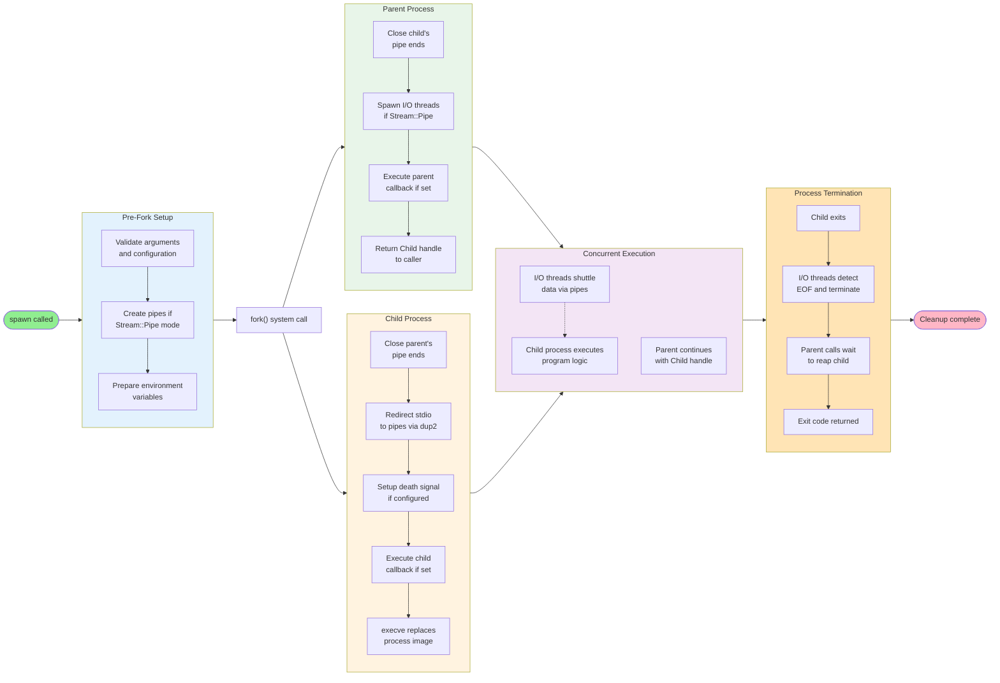
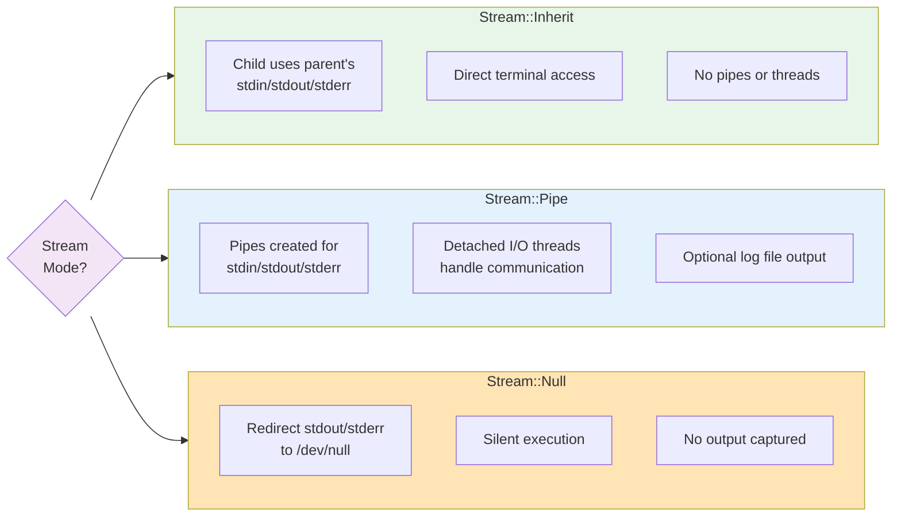
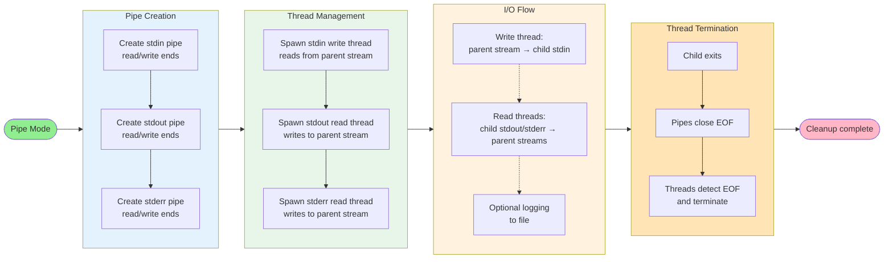
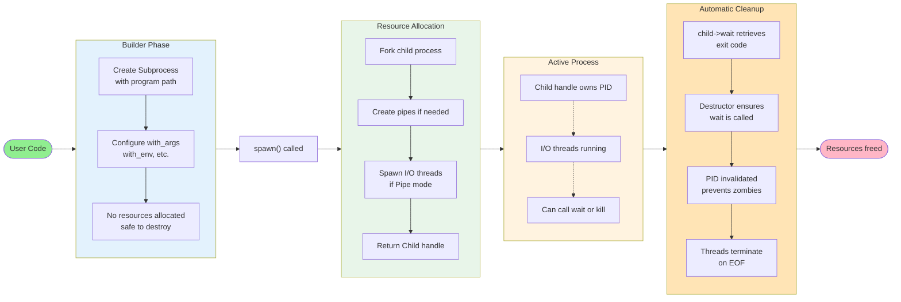

# Process Management

## Overview

The subprocess system provides a high-level interface for spawning and managing child processes. It abstracts the complexities of `fork()`, `execve()`, and pipe management into a fluent builder pattern that handles stream redirection, I/O threading, and automatic resource cleanup.

**Key Features:**

- **Builder Pattern**: Fluent API for process configuration
- **Stream Modes**: Inherit parent streams, redirect through pipes, or silence output
- **Automatic Cleanup**: RAII ensures processes are waited on, preventing zombies
- **I/O Threading**: Detached threads handle bidirectional communication
- **Callbacks**: User-defined hooks execute before and after fork

## Architecture

### Components

**Subprocess (Builder)**

- Configures process parameters using method chaining
- Accumulates arguments, environment variables, and stream settings
- Spawns the process and transfers ownership to a Child handle

**Child (RAII Handle)**

- Manages the lifetime of a spawned process
- Provides `wait()` to retrieve exit code and `kill()` to send signals
- Destructor automatically waits for process, preventing zombies

**Stream Modes**

- **Inherit**: Child uses parent's stdin/stdout/stderr directly
- **Pipe**: Creates pipes with detached I/O threads for bidirectional communication
- **Null**: Silences output by redirecting to `/dev/null`

**I/O Threads (Pipe Mode Only)**

- Automatically spawned as detached threads
- Handle stdin writes and stdout/stderr reads concurrently
- Terminate when child process exits or pipes close

## Process Spawning Lifecycle

The subprocess spawning process involves configuration, forking, and execution across parent and child processes:



**Process Flow:**

1. **Configuration**: Validates configuration and creates pipes if needed
2. **Fork**: Kernel creates a duplicate process; both continue from the same point
3. **Parent Path**: Closes unused pipe ends, spawns I/O threads, returns handle to user
4. **Child Path**: Closes unused pipe ends, redirects stdio, executes callbacks, calls execve
5. **Runtime**: Parent and child execute concurrently with I/O flowing through pipes
6. **Cleanup**: Child exits, threads terminate on EOF, parent waits for child


## Stream Modes

The subprocess system supports three stream handling modes that control how I/O is managed:



**Mode Characteristics:**

- **Inherit**: Child uses parent's streams directly. Best for interactive programs or when terminal access is required. No overhead.

- **Pipe**: Creates pipes with detached threads for bidirectional communication. Best for capturing output, feeding input, or logging. Threads automatically terminate when child exits.

- **Null**: Redirects output to `/dev/null` for silent execution. Best for background processes where output is not needed.

## I/O Communication (Pipe Mode)

When Stream::Pipe mode is used, the system automatically creates pipes and threads for bidirectional communication:



**Thread Behavior:**

- **stdin Writer**: Reads from parent's input stream and writes to child's stdin pipe. Monitors child process to detect termination.

- **stdout/stderr Readers**: Read from child's output pipes and write to parent's streams. Optionally log all output to file. Filter line endings and empty lines.

- **Automatic Termination**: All threads are detached and terminate automatically when the child exits (EOF on pipes).

## Resource Management

The subprocess system uses RAII (Resource Acquisition Is Initialization) to ensure proper cleanup:



**Key Guarantees:**

- **RAII Pattern**: Child destructor automatically waits for process, preventing zombie processes
- **Single Ownership**: Each Child handle exclusively owns one process PID
- **Thread Safety**: Detached I/O threads auto-terminate when child exits
- **No Resource Leaks**: Pipes and file descriptors are explicitly closed in both parent and child


## Usage Patterns

### Basic Process Execution

```cpp
// Simple command execution
auto result = Subprocess("/bin/ls")
    .with_args("-la", "/tmp")
    .spawn()
    ->wait();

if (result && *result == 0) {
    std::cout << "Success\n";
}
```

### Capturing Output

```cpp
// Capture stdout to string
std::ostringstream output;
auto child = Subprocess("/usr/bin/ps")
    .with_stdio(Stream::Pipe)
    .with_streams(std::cin, output, std::cerr)
    .with_args("aux")
    .spawn();

child->wait();
std::cout << "Captured: " << output.str() << "\n";
```

### Logging to File

```cpp
// Log all output to file
auto child = Subprocess("/usr/bin/make")
    .with_log_file("/tmp/build.log")
    .with_args("all")
    .spawn();

auto exit_code = child->wait();
```

### Custom Callbacks

```cpp
// Child callback: change directory before execve
Subprocess("/usr/bin/app")
    .with_callback_child([](ArgsCallbackChild args) {
        if (chdir("/tmp") < 0) {
            _exit(1);
        }
    })
    .spawn();

// Parent callback: track PID
pid_t child_pid;
Subprocess("/usr/bin/daemon")
    .with_callback_parent([&child_pid](ArgsCallbackParent args) {
        child_pid = args.child_pid;
        std::cout << "Spawned: " << args.child_pid << "\n";
    })
    .spawn();
```

### Process Supervision

```cpp
// Ensure child dies with parent
pid_t my_pid = getpid();
auto daemon = Subprocess("/usr/bin/service")
    .with_die_on_pid(my_pid)
    .spawn();

// Parent exits/crashes -> child receives SIGKILL
```

### Silent Execution

```cpp
// Background process with no output
auto background = Subprocess("/usr/bin/backup")
    .with_stdio(Stream::Null)
    .with_args("--full")
    .spawn();
```

### Concurrent Execution

```cpp
// Spawn multiple children concurrently
auto child1 = Subprocess("/bin/worker").with_args("task1").spawn();
auto child2 = Subprocess("/bin/worker").with_args("task2").spawn();
auto child3 = Subprocess("/bin/worker").with_args("task3").spawn();

// Wait for all
child1->wait();
child2->wait();
child3->wait();
```
