# Reserved Space

## Overview

FlatImage's reserved space is an embedded configuration storage area within the binary itself. This enables **post-build reconfiguration** without recompilation - you can modify permissions, environment variables, boot commands, and other settings after the binary has been built.

This architecture makes commands like `fim-perms add`, `fim-env set`, and `fim-boot set` possible by directly modifying the reserved section of the binary file.

## Conceptual Architecture

The reserved space acts as an embedded key-value store within the ELF binary, positioned between the executable code and the filesystem data:

**Key Concepts:**

- **Embedded Storage**: Configuration lives inside the binary file, not in external config files
- **Fixed Offsets**: Each configuration type has a dedicated region with known boundaries
- **Post-Build Modification**: Settings can be changed after compilation
- **Portable**: Configuration travels with the binary - no separate files needed

## Configuration Components

Reserved space stores multiple types of configuration data, each serving a specific purpose:

```mermaid
flowchart LR
    Start([Reserved Space]) --> Categories

    subgraph Categories["Configuration Types"]
        direction TB
        C1["🔒 Security Settings<br/>Permissions, isolation"]
        C2["🎨 Desktop Integration<br/>Icons, menus, MIME types"]
        C3["⚙️ Runtime Config<br/>Environment, boot commands"]
        C4["📁 Filesystem Config<br/>Bind mounts, overlay type"]

        C1 -.-> C2
        C2 -.-> C3
        C3 -.-> C4
    end

    Categories --> Management

    subgraph Management["Configuration Management"]
        direction TB
        M1["Read at boot<br/>Apply settings"]
        M2["Modify via fim-* tools<br/>Update on demand"]
        M3["Persist in binary<br/>No external files"]

        M1 --> M2
        M2 --> M3
    end

    style Categories fill:#E3F2FD
    style Management fill:#E8F5E9
    style Start fill:#90EE90
```

### Security Settings

**Permissions**

- Controls access to host resources (home directory, network, GPU, audio, etc.)
- Stored as a bitfield where each bit represents a permission flag
- Supports up to 64 different permission types
- **Commands:** `fim-perms add`, `fim-perms del`, `fim-perms list`

**Overlay Type**

- Selects which overlay filesystem to use (UNIONFS, OVERLAYFS, BWRAP)
- Affects performance and compatibility
- BWRAP provides native bubblewrap isolation
- **Commands:** `fim-overlay set`, `fim-overlay show`

**Casefold Flag**

- Enables case-insensitive filesystem behavior
- Critical for Windows application compatibility (Wine/Proton)
- Implemented via CIOPFS layer
- Cannot be combined with BWRAP overlay
- **Commands:** `fim-casefold on`, `fim-casefold off`

### Desktop Integration

**Desktop Configuration**

- Application name and metadata
- Integration types (desktop entries, MIME handlers, icons)
- Application categories for menu organization
- Stored as structured data
- **Commands:** `fim-desktop setup`, `fim-desktop enable`, `fim-desktop dump`

**Icon Data**

- Embedded application icon in PNG format
- Automatically resized to standard sizes for desktop integration
- Eliminates need for separate icon files
- **Commands:** `fim-desktop dump icon`

**Notify Flag**

- Controls desktop notifications on FlatImage startup
- Simple on/off toggle
- **Commands:** `fim-notify on`, `fim-notify off`

### Runtime Configuration

**Boot Command**

- Default command executed when FlatImage starts
- Defines the primary application to run
- Defaults to interactive shell if not set
- Includes command path and arguments
- **Commands:** `fim-boot set`, `fim-boot show`, `fim-boot clear`

**Environment Variables**

- Custom environment variables for the container
- Applied during container initialization
- Supports variable expansion
- Each entry is a key-value pair
- **Commands:** `fim-env add`, `fim-env set`, `fim-env del`, `fim-env list`

### Filesystem Configuration

**Bind Mounts**

- Host-to-guest filesystem mappings
- Defines what host directories are accessible inside the container
- Each bind has a source, destination, and access mode (read-only, read-write, device)
- **Commands:** `fim-bind add`, `fim-bind del`, `fim-bind list`

**Remote URL**

- URL for fetching remote resources (recipes, additional layers)
- Enables dynamic content loading
- Plain text storage
- **Commands:** `fim-remote set`, `fim-remote show`, `fim-remote clear`

## How Reserved Space Works

### Configuration Lifecycle

### Read and Write Operations

**Write Process:**

1. Validate that new data fits within allocated space
2. Open the binary file with write permissions
3. Navigate to the configuration's region
4. Clear existing data (zero-initialization)
5. Write new configuration data
6. Close the file

**Read Process:**

1. Open the binary file in read-only mode
2. Navigate to the configuration's region
3. Read the configuration data
4. Parse and validate the data
5. Return the configuration

**Safety Guarantees:**

- **Bounds Checking**: All operations validate that data fits within allocated space
- **Atomic Regions**: Each configuration type has an isolated region
- **Zero-Initialization**: Regions are cleared before writing to prevent data leakage
- **Error Handling**: Operations return success/failure status for robust error handling

### Practical Example

When you modify permissions, the following conceptual flow occurs:

## Advantages of Reserved Space

**Post-Build Reconfiguration**

- Modify settings without rebuilding the binary
- Changes take effect on next execution
- No recompilation needed

**Portability**

- Configuration embedded in the binary
- No external config files required
- Single file contains complete application

**Atomic Updates**

- Each configuration type isolated in its own region
- Changes to one setting don't affect others
- Safe concurrent reads

## Limitations

**Fixed Size Constraints**

- Each configuration type has a maximum size
- Operations fail if data exceeds limits
- Trade-off between flexibility and binary size

**Binary Modification Required**

- Every change modifies the binary file
- Requires write permissions
- Not ideal for read-only filesystems (requires copy)