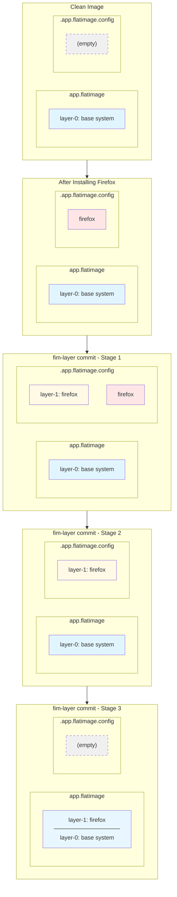

# Manage FlatImage Layers

## What is it?

`fim-layer` is a command to manage the filesystem layers of a FlatImage. Layers allow you to incrementally add software and configurations to your FlatImage without rebuilding from scratch. Each layer stacks on top of the previous ones, with newer layers taking precedence over older ones.

## How to Use

You can use `./app.flatimage fim-help layer` to get the following usage details:

```txt
fim-layer : Manage the layers of the current FlatImage
Usage: fim-layer <create> <in-dir> <out-file>
  <create> : Creates a novel layer from <in-dir> and save in <out-file>
  <in-dir> : Input directory to create a novel layer from
  <out-file> : Output file name of the layer file
Usage: fim-layer <add> <in-file>
  <add> : Includes the novel layer <in-file> in the image in the top of the layer stack
  <in-file> : Path to the layer file to include in the FlatImage
Usage: fim-layer <commit>
  <commit> : Compresses current changes and inserts them into the FlatImage
```

### Commit Changes into a New Layer

The `fim-layer commit` command is the quickest way to save your changes. It compresses the current filesystem modifications into a new layer and appends it to the FlatImage binary.

**Example: Installing and committing Firefox**

```bash
# Allow network access
./app.flatimage fim-perms add network,wayland,xorg,audio

# Install Firefox
./app.flatimage fim-root pacman -Syu
./app.flatimage fim-root pacman -S firefox

# Compress Firefox and its dependencies into a new layer
./app.flatimage fim-layer commit
```

After committing, the Firefox installation is permanently saved in your FlatImage. The changes persist across restarts without needing to reinstall.

---

### Create a Custom Layer

For more control, you can create a layer from a specific directory structure. This is useful when you want to add custom files, scripts, or configurations without installing packages.

**Example: Adding a custom script**

First, create the directory structure that mirrors where files should go in the FlatImage filesystem:

```bash
# Create the directory structure
mkdir -p ./root/usr/bin
```

The `root` directory represents the root filesystem of the FlatImage. Any files you place here will overlay the existing filesystem.

Create your custom script:

```bash
# Create a hello-world script
cat > ./root/usr/bin/hello-world.sh << 'EOF'
#!/bin/bash
echo "hello world"
EOF

# Make the script executable
chmod +x ./root/usr/bin/hello-world.sh
```

Now create the layer from your directory:

```bash
# Create a layer file from the 'root' directory
./app.flatimage fim-layer create ./root ./layer
```

This command compresses the contents of `./root` into a layer file named `./layer`.

---

### Add a Layer to FlatImage

Once you have a layer file (either created manually or received from another source), add it to your FlatImage:

```bash
# Add the layer to the FlatImage
./app.flatimage fim-layer add ./layer
```

The layer is now part of your FlatImage. Test that it works:

```bash
# Run the script
./app.flatimage fim-exec hello-world.sh
hello world

# Verify the script location
./app.flatimage fim-exec command -v hello-world.sh
/usr/bin/hello-world.sh
```

## How it Works

FlatImage uses a layered filesystem architecture where each layer is a compressed filesystem that overlays the previous ones.



**Layer Stacking:**

- Layers are stacked from bottom to top (oldest to newest)
- Files in newer layers override files in older layers
- The `.app.flatimage.config` directory holds uncommitted changes (working directory)
- When you run `fim-layer commit`, changes move from config to binary as a new layer

**Key Concepts:**

1. **Initial State** - Only base system layer exists
2. **During Installation** - Firefox installed in config directory (temporary)
3. **After Commit** - Firefox layer moves to binary (permanent)
4. **After Cleanup** - Config directory cleared, layers remain in binary

**Commands Comparison:**

- `fim-layer commit` - Automatically creates and adds a layer from your current uncommitted changes
- `fim-layer create` + `fim-layer add` - Manually create a layer from a specific directory, then add it. This gives you precise control over what goes into each layer