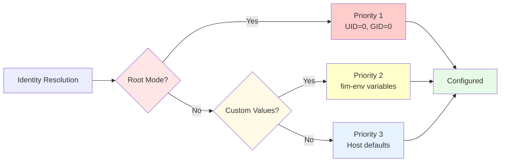

# User Identity Configuration

FlatImage provides flexible configuration for user identity within the container, including customizable UID/GID, username, home directory, and shell preferences. This allows applications to run with specific user contexts required for permissions, file ownership, or compatibility.

---

## What it is

### Overview

FlatImage automatically configures user identity within containers, this can be customized through environment variables set with `fim-env`.

### Configuration Priority Hierarchy

FlatImage uses a clear priority system to determine user identity:



This hierarchy ensures that:

- Root mode always gets UID=0, GID=0, /root regardless of other settings
- Users can override defaults with custom values via `fim-env`
- Sensible defaults are used when nothing is specified

### Password File Format

The generated `/etc/passwd` file follows standard Unix format:

```
username:x:UID:GID:GECOS:home:shell
```

**Field Meanings:**

- `username` - Login name (e.g., "root", "webapp", host username)
- `x` - Password placeholder (shadowed)
- `UID` - User ID number (e.g., 0, 1000, 5000)
- `GID` - Group ID number (e.g., 0, 1000, 5000)
- `GECOS` - User information field (set to username)
- `home` - Home directory path (e.g., "/root", "/home/user")
- `shell` - Login shell path (e.g., "/bin/bash")

---

## How to use

### Setting Custom UID and GID

Custom UID and GID values can be set using the `fim-env` command:

**Basic Example:**

```bash
# Set custom UID and GID
./app.flatimage fim-env add 'UID=5000' 'GID=5000'
# Verify inside container
./app.flatimage fim-exec id
```

**Default Behavior (no customization):**
```bash
# Without custom values, uses host user
./app.flatimage fim-exec id
# Output: uid=1000(username) gid=1000(groupname) groups=1000(groupname)
```

**Root Mode Override:**
```bash
# Root mode takes precedence over custom values
./app.flatimage fim-env add 'UID=5000' 'GID=5000'
./app.flatimage fim-root id
# Output: uid=0(root) gid=0(root) ...
```

### Setting Custom Username

Override the username displayed in the container:

```bash
# Set custom username
./app.flatimage fim-env add 'USER=container_user'
./app.flatimage fim-exec whoami
# Output: container_user
./app.flatimage fim-exec cat /etc/passwd
# Output: container_user:x:1000:1000:container_user:/home/host_user:/tmp/fim/.../bin/bash
```

### Setting Custom Home Directory

Change the home directory path:

```bash
# Set custom home directory
./app.flatimage fim-env add 'HOME=/opt/app/home'
# Outputs: /opt/app/home
./app.flatimage fim-exec echo $HOME
# username:x:1000:1000:username:/opt/app/home:/tmp/fim/.../bin/bash
./app.flatimage fim-exec cat /etc/passwd
```

**Default Shell Behavior:**
```bash
# Without SHELL variable, uses FlatImage's bundled bash
./app.flatimage fim-exec bash -c 'cat /etc/passwd'
# Output: username:x:1000:1000:username:/home/username:/tmp/fim/.../bin/bash
```

Combine all options for full control:

```bash
# Create complete custom identity
./app.flatimage fim-env add \
  'UID=5000' \
  'GID=5000' \
  'USER=webapp' \
  'HOME=/app' \
  'SHELL=/bin/dash' \
  'PS1=[webapp] \W > '

# Verify configuration
./app.flatimage fim-exec cat /etc/passwd
# Output: webapp:x:5000:5000:webapp:/app:/bin/dash

./app.flatimage fim-exec id
# Output: uid=5000(webapp) gid=5000 groups=5000

./app.flatimage fim-exec bash
# Prompt: [webapp] ~ >
```

**Reset to Defaults:**
```bash
# Remove all custom identity settings
./app.flatimage fim-env del UID GID USER HOME SHELL PS1
# Now uses host defaults
./app.flatimage fim-exec id
# Output: uid=1000(host_user) gid=1000(host_group) ...
```

## How it works

### Overview

When you execute a command in FlatImage, the system automatically configures the user identity for the containerized environment. This happens transparently before your application starts, ensuring the correct user, permissions, and environment are in place.

### Identity Resolution Process

The system resolves user identity through a three-tier priority system:

#### 1. Mode-Based Override
- **Root mode** (`fim-root`): Always uses UID=0, GID=0, username="root", home="/root"
- **User mode** (`fim-exec`): Proceeds to check environment variables

#### 2. Custom Configuration

Environment variables set via `fim-env` take precedence:
- `UID` / `GID` - Numeric user/group IDs
- `USER` - Username string
- `HOME` - Home directory path
- `SHELL` - Shell executable path
- `PS1` - Shell prompt format

#### 3. Host Defaults

If no custom values are set, FlatImage uses the current host user's information via `getpwuid()`.

### Generated Files

FlatImage creates temporary configuration files for each container instance:

**`/etc/passwd` Entry**:

```
username:x:UID:GID:username:home:shell
```

- Standard Unix format with single user entry
- Bound into container at `/etc/passwd`
- Location: `$FIM_DIR_INSTANCE/passwd`